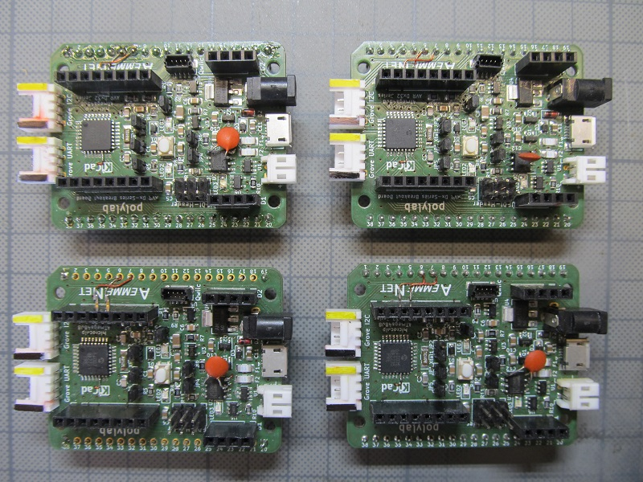
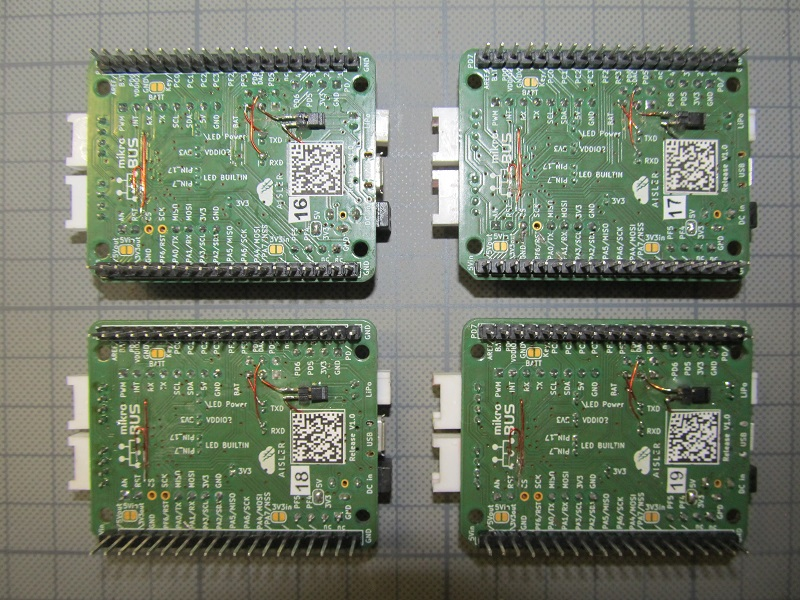
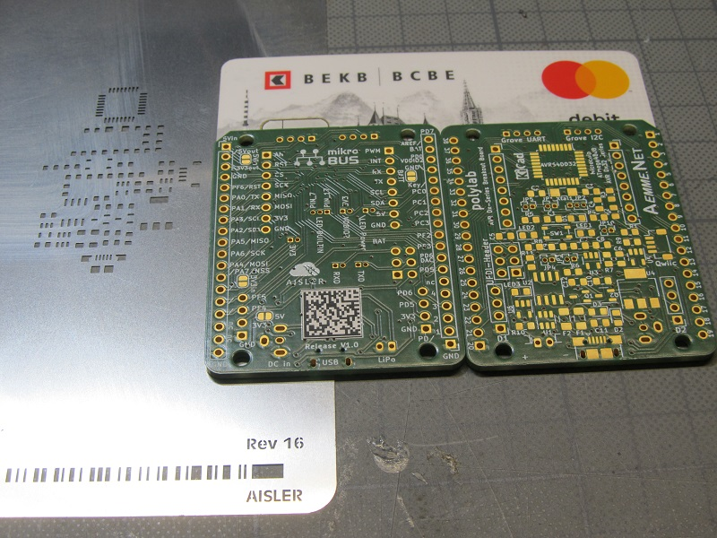
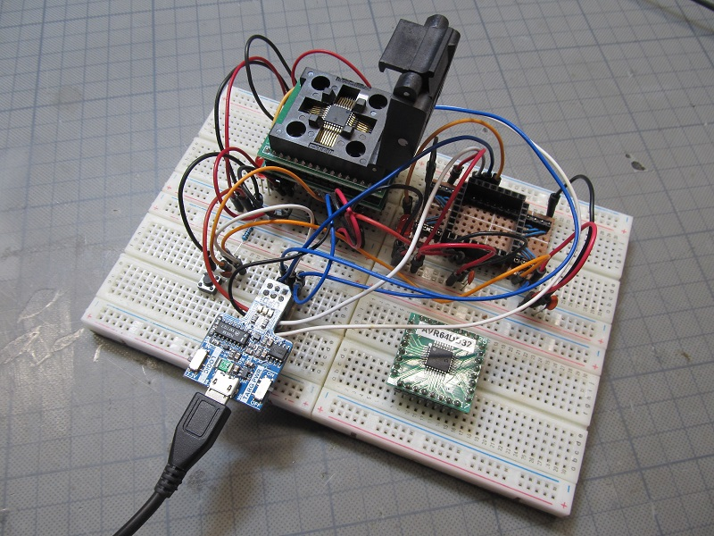
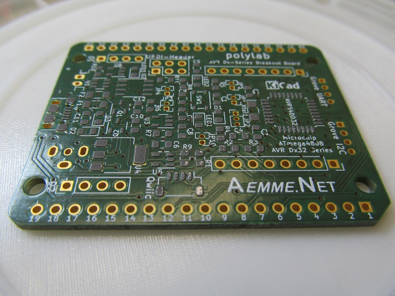
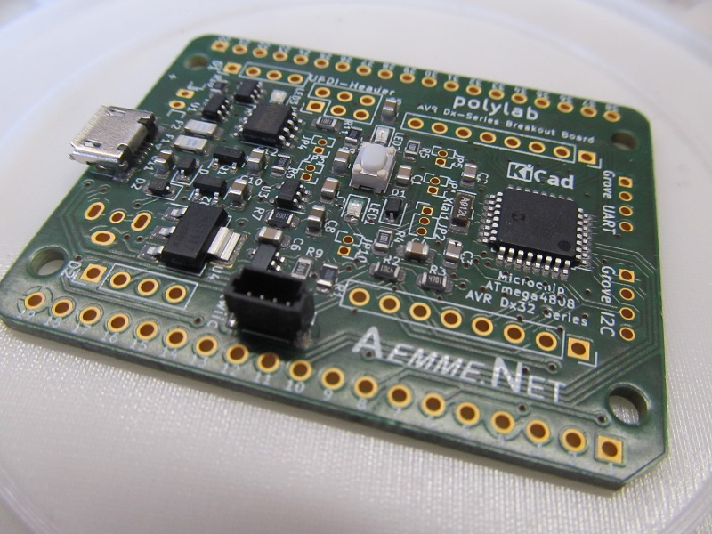
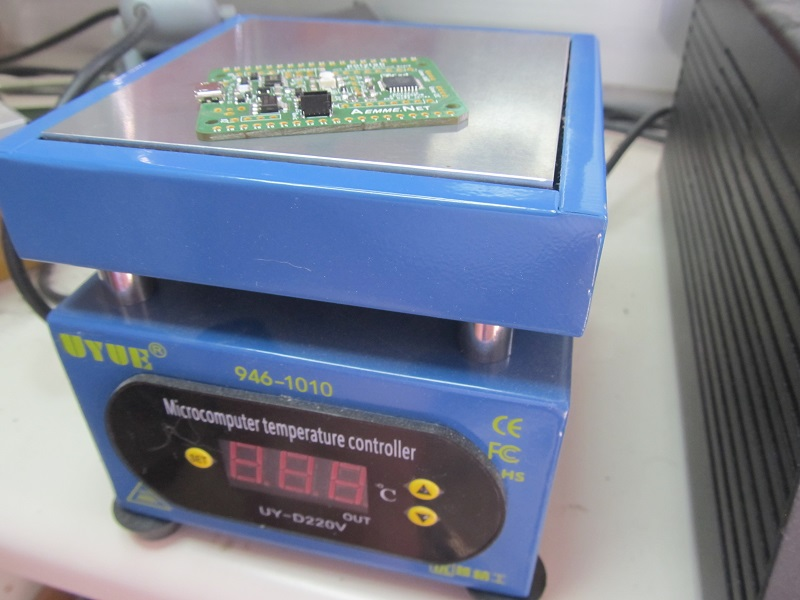
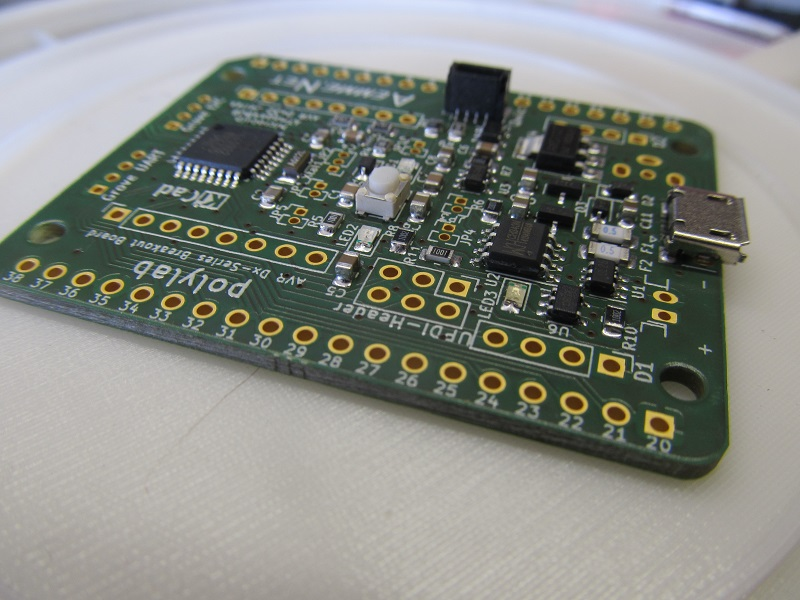
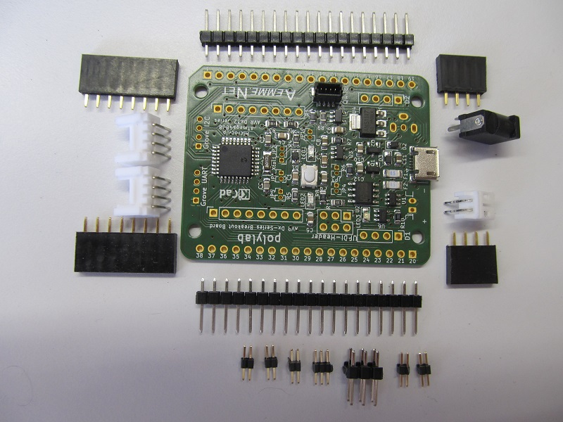
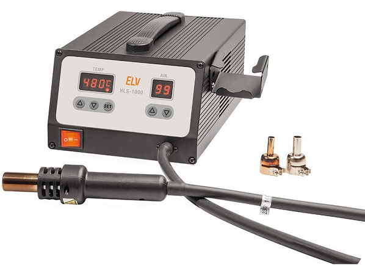

Is continually being updated ...  

First release prototypes with some handwired fixes and improvements. Ready for next release ...  
    
AISLER Beauitiful Boards  
  
UPDI Programmer  
  
Ready for pick and place ...  
  
Solder Paste applied  
  
SMD components placed  
  
on the HotPlate  
  
SMD components soldered ...  
  
THT components ready ...  
  
SMD Rework Station  
  
