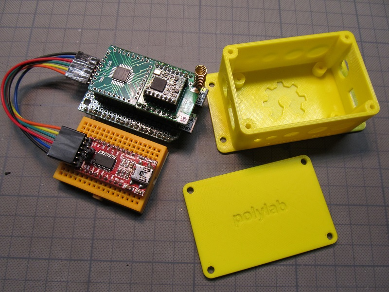

## "polylab" DIY Microchip AVR® Dx32-Series Board

### Hardware:

- 2 layer PCB made with KiCad 7 EDA.
- KiCAD learned with https://www.udemy.com/course/kicad-like-a-pro-3e/
- PCB manufactured by: https://aisler.net/
- proprietary form factor: 1/2 credit card size ( 53.98 x 42.8 mm)  
- 2 x 19 pin pinheader with proprietary "polylab" pinout

### MCU:

Microchip AVR64DD32 (QFP32 socket). Replacement or successor for the old ATmega328P?
* https://www.youtube.com/watch?v=M-myqg-2c5s
* https://www.arduino.cc/en/software IDE Version 2.2.1 ok for my tests (November 1, 2023)
* https://github.com/SpenceKonde/DxCore Current release 1.5.10 (October 28, 2023)
* [SerialUPDI programmer](https://www.tindie.com/products/mcudude/serialupdi-programmer) Flashing Optiboot bootloader ok with the above versions

Flashing Optiboot Bootloader via UPDI Target Header on Development Board.

### mikroBUS™:

* https://www.mikroe.com/mikrobus
* https://www.mikroe.com/click
* [Sensirion & mikroBUS™](https://developer.sensirion.com/partner-spotlight/partner-spotlight-mikroelektronika) , [ETHzürich & mikroBUS™](https://pbl.ee.ethz.ch/education/embedded-systems.html) , [Microchip & mikroBUS™](http://ww1.microchip.com/downloads/en/DeviceDoc/Curiosity-Nano-Base-for-Click-boards-User-Guide-50002839B.pdf) , [u-blox & mikroBUS™](https://www.u-blox.com/en/product/xplr-hpg-1)

### First Experimental Tests:  
based on Arduino IDE Examples for Custom Libraries

 MCCI LoRaWAN LMIC-node connected to TTN ...

 Graphics test with SPI TFT on mikroBUS™ port ...
 
 GPS-Module and LiPo-Cell added & tested (--> TTN Mapper) ...

 needs to be synced with RTC or GPS ...

### Peripheral Connectors
- 2 x 19 pin pinheader with proprietary "polylab" pinout  
- mikroBUS™ compatible port 
- 2 x Grove connector (I2C & UART)  
- 1 x Qwiic® connector
- MicroUSB (CH340N USB to UART converter)
   
### Power Supply Connectors
- Barrel Jack  7-12V DC, 3.5*1.3mm ( to 5V with AMS1117-5.0)  
- MicroUSB (5V to 3V3 with AP2112K-3.3)  
- JST PH 2.0  for Single LiPo cell (MCP73831 charge controller)  
- 6 pin UPDI-target-header

This board is still a work in progress! There is a list of about 25 changes or improvements for the next version.

### DIY mikroBUS™ Port compatibles Modules:

 Breakout adapter from RFM95W to mikroBUS™ port

 8 daisy-chained NeoPixel

 LED's on all pins for mikroBUS™ port testing

### "polylab"-Prototyping Ecosystem:

 PCB on doubler board

 PCB on breadboard

 PCB stacked

### "polylab"-Custom Boards:

 made with regular protoboards

#### Planned:

Energy Harvesting
* (https://www.tindie.com/products/jaspersikken/solar-harvesting-into-li-ion-battery)

Customize 3D printed case programmed with OpenSCAD modeller
* (https://openscad.org)

