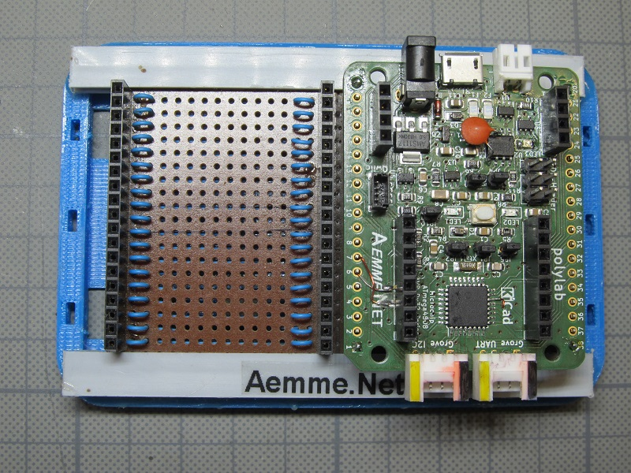

## "polylab" Microchip AVR Dx32-Series Development-Board

### Hardware:

- 2 layer board made with KiCad 7 EDA. Learned with https://www.udemy.com/course/kicad-like-a-pro-3e/
- proprietary form factor: 1/2 credit card size ( 53.98 x 42.8 mm)  
- 2 x 19 pin pinheader with proprietary "polylab" pinout

### MCU:

Microchip AVR64DD32 (QFP32 socket)
* https://www.youtube.com/watch?v=M-myqg-2c5s
* https://github.com/SpenceKonde/DxCore Current release 1.5.10 (October 28, 2023)
* [SerialUPDI programmer](https://www.tindie.com/products/mcudude/serialupdi-programmer)

Programming Optiboot Bootloader with SerialUPDI programmer via UPDI Target Header on Development Board.

### mikroBUS™:

* https://www.mikroe.com/mikrobus
* https://www.mikroe.com/click
* [Sensirion & mikroBUS™](https://developer.sensirion.com/partner-spotlight/partner-spotlight-mikroelektronika)

### First Experimental Tests:  
based on Arduino IDE Examples für Custom Libraries

 MCCI LoRaWAN LMIC-node connected to TTN ...

 Graphics test with SPI TFT on mikroBUS™ port ...
 
 GPS-Module and LiPo-Cell added & tested (--> TTN Mapper) ...

 Still needs to be synced with RTC or GPS ...

### Peripheral Connectors
- 2 x 19 pin pinheader with proprietary "polylab" pinout  
- mikroBUS™ compatible port 
- 2 x Grove connector (I2C & UART)  
- 1 x Qwiic® connector
   
### Power Supply Connectors
- Barrel Jack  7-12V DC, 3.5*1.3mm (AMS1117-5.0)  
- MicroUSB (CH340N USB to UART converter)  
- JST PH 2.0  for LiPo battery (MCP73831 charge controller)  
- 6 pin UPDI-target-header

This board is still a work in progress. There is a list of about 25 changes or improvements for the next version.

### DIY mikroBUS™ Port compatibles Modules:

 Breakout adapter from RFM95W to mikroBUS™ port

 8 daisy-chained NeoPixel

 LED's on all pins for mikroBUS™ port testing

### "polylab"-Prototyping Ecosystem:

 PCB on doubler board

 PCB on breadboard

 PCB stacked

### "polylab"-Custom Boards:

 made with regular protoboards

#### Planned:

Energy Harvesting
* (https://www.tindie.com/products/jaspersikken/solar-harvesting-into-li-ion-battery)

Customize 3D printed case programmed with OpenSCAD modeller
* (https://openscad.org)

