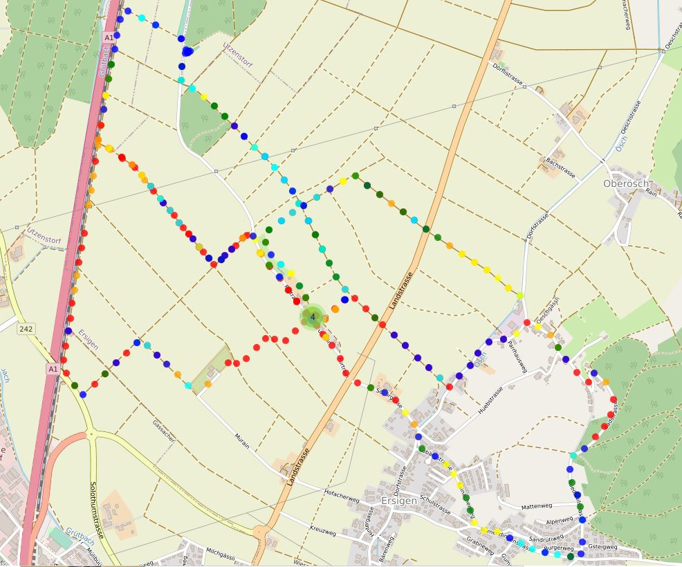
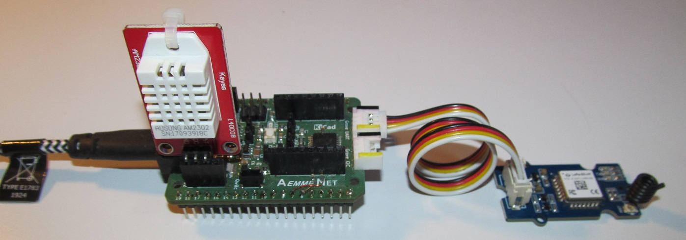
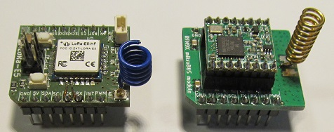

## "polylab" DIY Microchip AVR® Dx32-Series Development-Board

### Hardware:

- 2 layer PCB designed with KiCad 7 EDA.
- [KiCad learned with ûdemy course](https://www.udemy.com/course/kicad-like-a-pro-3e)
- [PCB manufactured by Aisler]( https://aisler.net)
- proprietary form factor: 1/2 credit card size ( 53.98 x 42.8 mm)

### MCU:

Microchip AVR64DD32 (QFP32 socket). Replacement or successor for the old ATmega328P?
* [8-bit MCUs: Still Thriving After 50 Years](https://www.microchip.com/en-us/about/media-center/blog/2023/the-8-bit-microcontroller-is-still-thriving?utm_campaign=8bit-mcus-embedded-design&utm_source=twitter.com&utm_medium=Post&utm_content=SharePoint45090.75)
* [If you're a fan of ATmega, try AVR Dx](https://lcamtuf.substack.com/p/psa-if-youre-a-fan-of-atmega-try)
* [AVR® DD Product Family Overview](https://www.youtube.com/watch?v=M-myqg-2c5s)
* [AVR Peripheral Deep Dive](https://mu.microchip.com/avr-peripheral-deep-dive-pub?utm_campaign=mcu8-avr-microchip-university&utm_source=twitter.com&utm_medium=Post&utm_content=SharePoint45169.5833)
* https://www.arduino.cc/en/software Arduino IDE
* https://github.com/SpenceKonde/DxCore Arduino support for the AVR DA, DB-series and DD-series
* [SerialUPDI programmer](https://www.tindie.com/products/mcudude/serialupdi-programmer) Flashing Optiboot bootloader ok with the above versions

Flashing Optiboot Bootloader via UPDI Target Header.

### mikroBUS™:

* https://www.mikroe.com/mikrobus
* https://www.mikroe.com/click
* [Sensirion & mikroBUS™](https://developer.sensirion.com/partner-spotlight/partner-spotlight-mikroelektronika) , [ETHzürich & mikroBUS™](https://pbl.ee.ethz.ch/education/embedded-systems.html) , [Microchip & mikroBUS™](http://ww1.microchip.com/downloads/en/DeviceDoc/Curiosity-Nano-Base-for-Click-boards-User-Guide-50002839B.pdf) , [u-blox & mikroBUS™](https://www.u-blox.com/en/product/xplr-hpg-1)

### First Experimental Tests based on Arduino IDE Examples for Custom Libraries
  
 MCCI LoRaWAN LMIC-node connected to TTN ...  
Tested with Arduino IDE 2.3.3 and DxCore Version 1.5.11  
  Graphics with SPI TFT displays on mikroBUS™ socket ...  
Adafruit example sketch *graphicstest.ino* with ST7735 and ST7789 library. Initialize ST7789 240x240 with tft.init(240, 240, __SPI_MODE3__) https://tigoe.github.io/display-examples
 
  u-blox PAM-7Q GPS Module added (--> TTN-Mapping walk) ...

 needs to be synced with RTC or GPS ...  

 PoLoLu Stepper Motor Driver on mikroBUS™ Modul ...

 DHT22 Temperature/Humidity Sensor (incl. Payload Encoding / Decoding) ...

 Servo Sweep (#include <Servo_DxCore.h>) ...  
  
   

Test mikroBUS CO2 click board with Sensirion STC31-sensor on my "polylab" Development-Board with mikroBUS socket.
Sketches with Sensirion-Arduino library and SparkFun Arduino Library for STC3x sensor. CO2 gas for testing produced with baking soda and water.  
  
  

First successful TTN test with Grove Wio E5 LoRa-E5 Arduino Library from Sylvain Montagny.  
https://github.com/SylvainMontagny/LoRaE5   
Successful upload of DHT22 sensor data.  
Successful switching LED_BUILTIN according to PayloadDown value (0x00/0x01)    

 
Next project: mikroBUS Board with Seeed StudioLoRa Grove Wio-E5 Module.  
  

### Peripheral Connectors
- 2 x 19 pin male pinheader with Arduino/MKR- Adafruit/Feather- like pinout  
- mikroBUS™ socket 
- 2 x Grove connector (I2C & UART)
- 2 x 4-pin header (female) with Grove Digital/Analog pinout
- 1 x Qwiic® connector
- MicroUSB (CH340N USB to UART converter)
   
### Power Supply Connectors
- Barrel Jack  7-12V DC, 3.5*1.3mm ( to 5V with AMS1117-5.0)  
- MicroUSB (5V to 3V3 with AP2112K-3.3)  
- JST PH 2.0  for Single LiPo cell (MCP73831 charge controller)  
- 6-pin UPDI-target-header (male)

This board is still a WiP! There is a list with many changes, improvements and extensionss for the next version.

### DIY mikroBUS™ Socket compatibles Hardware-Modules:

 Breakout adapter from RFM95W module to mikroBUS™ socket

  8 daisy-chained NeoPixel

 LED's on all pins for mikroBUS™ socket testing

 PoLoLu Stepper Motor Driver

### "polylab"-Prototyping Ecosystem:

 PCB on doubler board

 PCB on breadboard

 PCB stacked

 powered with DC (9V battery), USB or LiPo

### "polylab"-Custom Boards:

 made with regular protoboards and pinheaders

### Modelling a case with OpenSCAD (done) (https://openscad.org)

  

### Planned:

   Low Power / Sleep Mode 
   [Energy Harvesting](https://www.tindie.com/products/jaspersikken/solar-harvesting-into-li-ion-battery)

### Work in Progress: mikroBUS Board with Seeed Studio Wio-SX1262 Module.

   [Wio-SX1262 Wireless Module](https://www.seeedstudio.com/Wio-SX1262-Wireless-Module-p-5981.html) 
   [XIAO ESP32S3 & Wio-SX1262 Kit for Meshtastic & LoRa](https://www.seeedstudio.com/Wio-SX1262-with-XIAO-ESP32S3-p-5982.html) 
   [Wio-SX1262 for XIAO](https://www.seeedstudio.com/Wio-SX1262-for-XIAO-p-6379.html) 
 
Test environment:  
    
"polylab" Triple-Board with "polylab" Dev.-Board, Wio-SX1262 extension board and Bosch BME280 Sensor / SSD1306 OLED Display
  
Successful LoRaWAN test with [Arduino RadioLib library](https://github.com/jgromes/RadioLib) on my DIY Microchip AVR64DD32 board with Wio-SX1262 Module and Arduino DXcore.

   23:29:08.532 -> 
   23:29:08.532 -> Setup ... 
   23:29:08.532 -> Initialise the radio 
   23:29:08.576 -> Join ('login') the LoRaWAN Network 
   23:29:14.223 -> Ready! 
   23:29:14.223 -> 
   23:29:14.270 -> Sending uplink 
   23:29:19.897 -> Received a downlink 
   23:29:19.940 -> Next uplink in 300 seconds 

Disadvantage of Arduino RadioLib library:
Sketch uses 63572 bytes (97%) of program storage space. Maximum is 65024 bytes.  
Comment of the maintainer of the RadioLib library: Unfortunately, small footprint was not one of the design goals of this library!

The [Arduino MCCI LoRaWAN LMIC library](https://docs.arduino.cc/libraries/mcci-lorawan-lmic-library) supports the SX1262 since [Verion 5](https://github.com/mcci-catena/arduino-lmic/discussions/982) but my setup for the Wio-SX1262 doesn't work yet.  

The microBUS-layout will be based on these two modules already made.  

