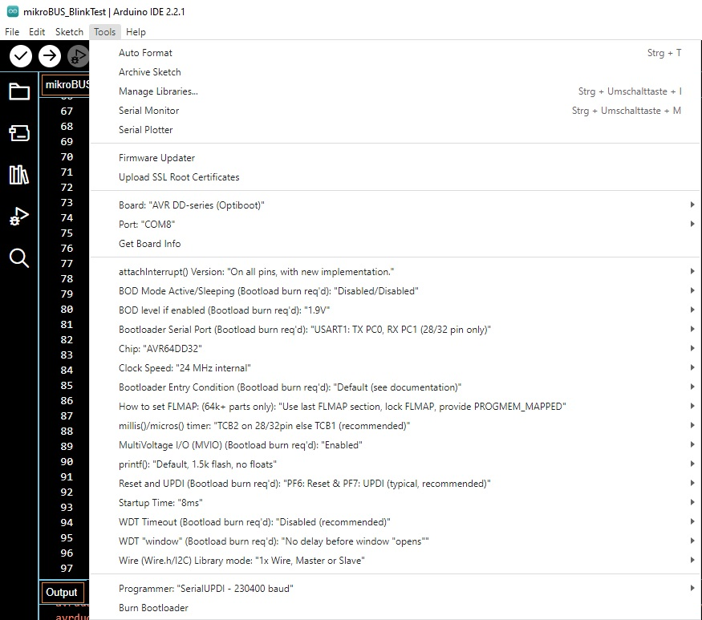

Is continually being updated ...  

### Programming the Microchip AVR Dx Series with Arduino

October 8, 2023: MCCI LoRaWAN LMIC-node test sketch needs Arduino IDE 1,8.19 with DxCore Version 1.5.8.

- Arduino IDE Tools Config:

-   
